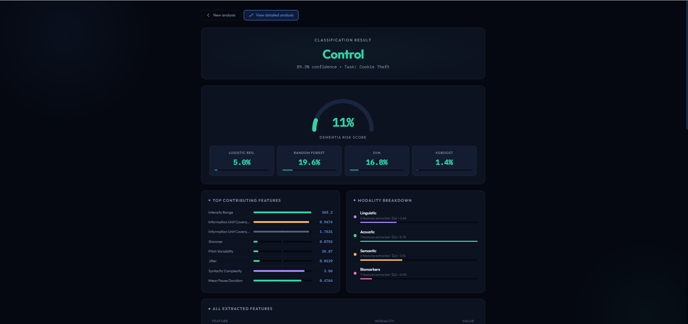
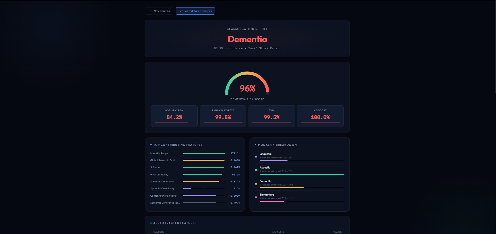
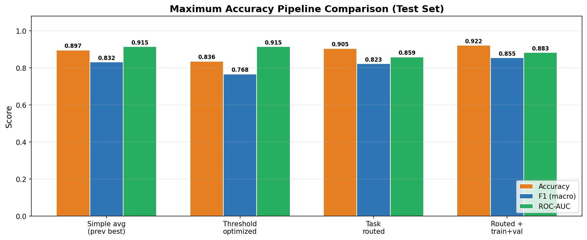
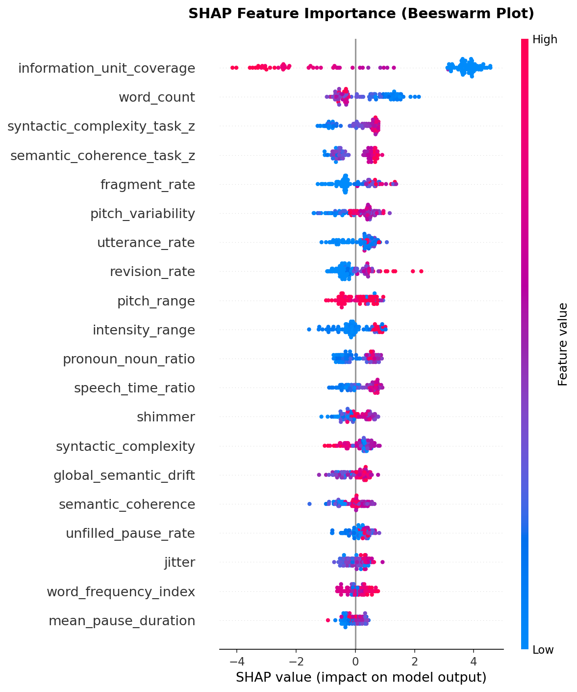
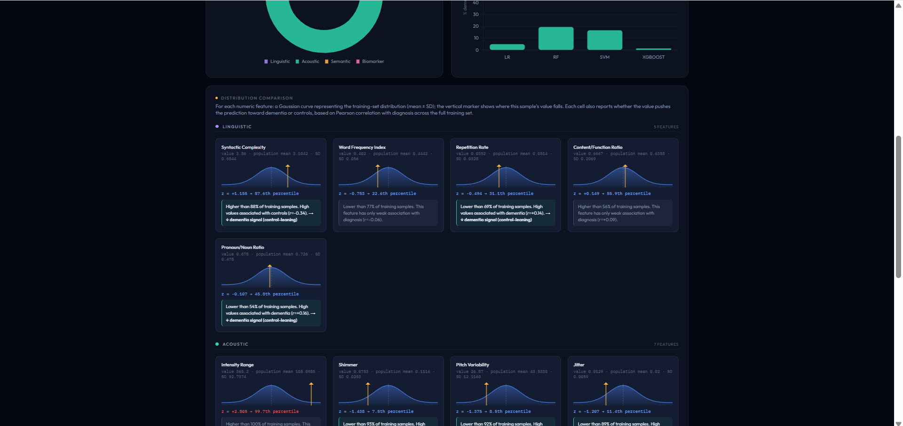

<div align="center">

# 🧠 NeuroLinguist

### AI-Based Alzheimer's Detection through Multi-Modal Speech Analysis

**92.2% accuracy** on the DementiaBank Pitt Corpus — beating the published 88% benchmark — using a task-routed ensemble of hand-crafted acoustic, linguistic, and semantic features, deployed as an interpretable web application.

[Demo Video](https://youtu.be/Ef0dQhjh0Vk) · [Report](docs/NeuroLinguist_Final_Report.pdf) · [How to Run](#-running-the-web-app)

    

</div>

---

## Overview

NeuroLinguist screens for cognitive decline from a single speech sample. It mirrors the way a clinician listens — *what* is said, *how* it's said, and whether it *makes sense* — by extracting 32 features across four modalities from a transcript (and optional audio), then routing the sample to a task-specific ensemble of classifiers.

It was built as a final-year capstone (EECE 502) at the **American University of Beirut**.

**Team:** Wassim Kassem · Ali El Hajj · Tamer Lammam  
**Advisor:** Dr. Karim Kabalan

<div align="center">

| Healthy control | Dementia |
|:---:|:---:|
|  |  |

</div>

---

## Key Results

The headline model is a **task-routed ensemble**: samples from the *Cookie Theft* picture-description task and the non-cookie tasks (recall, fluency, sentence) are routed to separate specialist ensembles, each combining Logistic Regression, SVM, Random Forest, and XGBoost.

| Pipeline | Accuracy | F1 (macro) | ROC-AUC |
|----------|:--------:|:----------:|:-------:|
| Baseline (best single model) | 87.9% | 0.816 | 0.902 |
| BERT multimodal fusion | 86.2% | 0.783 | 0.906 |
| Enhanced XGBoost (32 features) | 88.8% | 0.800 | 0.913 |
| Weighted-confidence ensemble | 90.5% | 0.843 | 0.881 |
| **Task-routed ensemble (final)** | **92.2%** | **0.855** | **0.883** |

> **Benchmark:** the comparable published result (Sarawgi et al. / the widely-cited Pitt Corpus baseline) reaches ~88%. NeuroLinguist's task-routed ensemble exceeds it.

<div align="center">



</div>

### One lesson worth highlighting

We fine-tuned **BERT** as a multimodal deep-learning baseline. It reached ~85% — **below** the 92.2% of the engineered-feature ensemble. On a small clinical dataset (~1,100 samples), carefully designed hand-crafted features beat a large pretrained transformer. The BERT experiment is preserved in `scripts/modeling/04_bert_multimodal.py` as a documented, evidence-based dead-end rather than removed — it's part of the story of how the final design was chosen.

---

## How It Works

```
                         ┌─────────────────────────────┐
   Transcript (.cha /    │  Feature Extraction          │
   pasted text)  ─────▶  │  • Linguistic (spaCy)        │
                         │  • Semantic  (Sentence-BERT) │ ──┐
   Audio (.wav/.mp3,     │  • Acoustic  (Parselmouth)   │   │
   optional)     ─────▶  │  • Disfluency biomarkers     │   │
                         └─────────────────────────────┘   │
                                                            ▼
                                        ┌───────────────────────────────┐
                                        │  Task Router                   │
                                        │  cookie?  ──▶ cookie ensemble  │
                                        │  else     ──▶ non-cookie ens.  │
                                        └───────────────────────────────┘
                                                            │
                          ┌─────────────────────────────────┘
                          ▼
        ┌──────────────────────────────────────┐
        │  Specialist Ensemble (soft-vote)      │
        │  Logistic Reg · SVM · RF · XGBoost    │
        └──────────────────────────────────────┘
                          │
                          ▼
        Prediction + confidence + SHAP-style explanation
```

The web app's feature extraction is written to mirror the training scripts line-by-line, so inference is consistent with how the models were trained.

### The 32 features (4 modalities)

- **Linguistic (spaCy):** syntactic complexity, pronoun/noun ratio, repetition rate, word-frequency index, content/function ratio.
- **Acoustic (Praat / Parselmouth):** mean pause duration, speech-time ratio, pitch range, pitch variability, intensity range, jitter, shimmer.
- **Semantic (Sentence-BERT):** semantic coherence, information-unit coverage, story-recall similarity, global semantic drift — plus task-normalized (z-scored) variants.
- **Disfluency biomarkers:** filler rate, unfilled-pause rate, revision rate, fragment rate, utterance rate, words-per-utterance, word count.

The single strongest separator is **information-unit coverage** (Cohen's *d* ≈ +2.0) — how much of the expected visual scene the speaker actually describes.

---

## Interpretability

Healthcare screening is only useful if a clinician can see *why*. NeuroLinguist provides:

- **SHAP feature attributions** — global importance and per-prediction breakdowns.
- **A plain-English clinical interpretation** generated per sample.
- **Per-feature distribution comparisons** — each value plotted against the training-population Gaussian, with z-score and percentile.

<div align="center">



*SHAP beeswarm — feature impact across the test set.*



*Per-feature distribution view from the web app.*

</div>

---

## Running the Web App

### Option A — Docker (recommended)

```bash
cd app
docker compose up --build
# open http://localhost:5000
```

### Option B — local Python

```bash
cd app
python -m venv venv
source venv/bin/activate        # Windows: venv\Scripts\activate
pip install -r requirements.txt
python -m spacy download en_core_web_sm
python app.py
# open http://localhost:5000
```

Upload a CHAT (`.cha`) transcript or paste text, choose the cognitive task, optionally add audio, and click **Analyze**. The trained models ship in `app/models/` (~5 MB), so no training is required to run the demo.

---

## Reproducing the Pipeline

Requires DementiaBank Pitt Corpus access — see **[DATA.md](DATA.md)**.

```bash
# 1. Preprocess transcripts
python scripts/preprocess_transcripts/run_preprocessing.py

# 2. Extract features
python scripts/feature_extraction/extract_linguistic_features.py
python scripts/feature_extraction/extract_acoustic_features_fast.py   # ~30x faster than librosa
python scripts/feature_extraction/extract_semantic_features.py
python scripts/feature_extraction/clean_and_merge_features.py

# 3. Train & evaluate (numbered in order)
python scripts/modeling/01_prepare_data.py        # participant-level split (no leakage)
python scripts/modeling/02_train_baselines.py
python scripts/modeling/07_max_accuracy.py        # task-routed ensemble (final)
python scripts/modeling/09_shap_analysis.py
python scripts/modeling/10_export_models.py        # → app/models/
```

> The acoustic extractor uses **Parselmouth/Praat** instead of librosa, cutting extraction from ~8 hours to ~15 minutes.

---

## Repository Layout

```
NeuroLinguist/
├── app/            Flask web app (app.py, templates, Dockerfile, trained models)
├── scripts/        Full pipeline: setup → preprocessing → features → modeling (01–10)
├── notebooks/      Exploratory data analysis
├── results/        All EDA, modeling, and SHAP outputs + metrics
├── docs/           Final report (PDF), poster, presentation
├── assets/         Screenshots used in this README
├── DATA.md         How to obtain the (restricted) dataset
└── LICENSE         MIT (code only; dataset excluded)
```

---

## Tech Stack

**ML:** scikit-learn, XGBoost, SHAP · **NLP:** spaCy, Sentence-BERT (all-MiniLM-L6-v2) · **Audio:** Praat / Parselmouth · **App:** Flask, Docker · **Data:** pandas, NumPy

---

## References & Notes

- **DementiaBank Pitt Corpus** — https://dementia.talkbank.org/
- **ADReSS Challenge** — https://luzs.gitlab.io/adress/
- This is a research/educational screening tool, **not** a diagnostic device. It does not provide a clinical diagnosis.

<div align="center">

**Wassim Kassem** · Ali El Hajj · Tamer Lammam — American University of Beirut, 2026  
Advisor: Dr. Karim Kabalan

</div>
